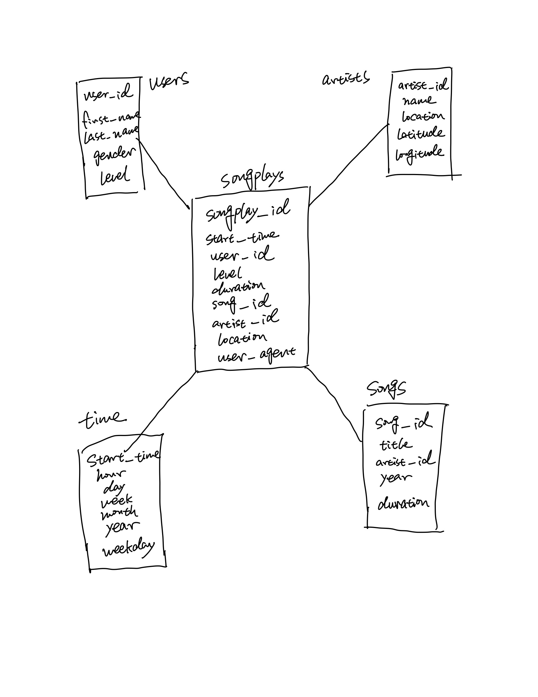

# data-modeling-postgreSQL

## Introduction
Sparkify is a startup music company and want to design a database that could help them understand what kind of music their user is listening to. 

## Data Description 
We have two type of json file here, one is song information and other is log information, they're both in json format. 
* songs: JSON files with data such as song title, artist name,song duration,year etc.
* logs: JSON files with data such as user log information and date time information. 

## Star Schema 
* Fact Table: songplay 
* Dimension Table: users,songs,songsplay,time 



## Files Explaining
* create_tables.py: It's a python file that will create table and drop table when we use the database 
* sql_queries.py: It's a python file that contain all the sql queries statement that will drop and create tables that will build the star schema we have above 
* test.ipynb: It's a notebook file that will test our queries in the table 
* etl.ipynb: A notebook file that go through the ETL process 
* etl.py: The actual python file that build the ETL pipeline 

## Instruction
First, go to the terminal and run the create_tables.py
```
python3 create_tables.py
```
Second, we need to run test.ipynb to check if the table we created is correct

Third, you can either run etl.ipynb and see the result in test.ipynb or run the pipeline and see the result in test.ipynb 
```
python3 etl.py
```
